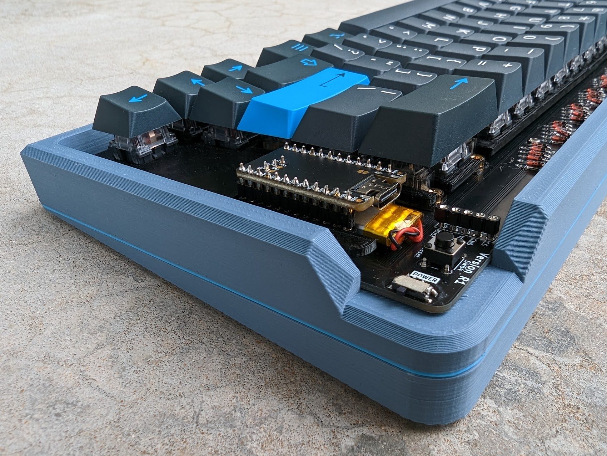

# RunTypeV2

The RunTypeV2 is the 2nd iteration of me getting involved in the mechanical keyboard hobby and trying to make something from scratch; this time with a self designed PCB!
Below are some details surrounding the project, along with the source files, links to products used, "lessons learned"

## The Parts List

- $25 - [Nice!Nano](https://nicekeyboards.com/nice-nano/)
- $20 - [Nice!View](https://nicekeyboards.com/nice-view) - PENDING STOCK
- $3 - [110mA Battery](https://typeractive.xyz/products/lithium-battery-110mah)
- $15 - [Mystery Switches](https://novelkeys.com/products/mystery-switches) - Attempts to lower the expenses
- $5.99 [100 pieces diodes 1N4148](https://www.amazon.com/dp/B079KJ91JZ?psc=1&ref=ppx_yo2ov_dt_b_product_details)
- $10.50 [70 Hotswap Sockets](https://typeractive.xyz/products/hotswap-sockets)
- $100 [Umbra PBT Keycaps](https://kbdfans.com/products/pbtfans-umbra) - This is where I allocated the majority of the budget. I was hooked at the color theme.
- $16.99 [Screw-in Stabilizers](https://www.amazon.com/dp/B0888932PV)
- $25 - [Getting PCBs made](https://jlcpcb.com/) I used JLCPB to get my PCB ordered. $25 (new customer discount) got me 5 PCBs.

Rough Estimate: $200

The rest of the parts I had on hand, but do have links to what they were

- $100 - $200 - Ender 3D printer
- $10-20/color - PLA/PLA+ 1.75mm 3D printing filament
- $10 [Pin Headers](https://www.amazon.com/gp/product/B07BS126FK)
- $XX - Wires

## The PCB Design

I wanted to stick the common 65%(ish) theme when designing my PCB. Kept it symbol and really used this design to learn KiCAD. I used this [youtube video](https://www.youtube.com/watch?v=7O8xGd7Pd88)
to learn the basics. From there, it was a lot of trial and error on getting the correct footprints. Getting the nicenano/view footprints was something I googling to get. I still need to get this cleaned up to include as source files.

After I felt like I was complete with the PCB, I used JLCPB (they seemed like the cheapest) to upload the gerber file and start the manufacturing. Honestly, the site was great with updates. It cost about $10 to make and $15 to ship!
The process took about 3 months. And of course, within 24 hours of placing the order I realized some changes I would have made in my design.

Some key parts I had to learn

- Importing footprints and then accessing them
- Adding a copper backplate
- Leveraging front/back wire swapping
- Inserting images
- Exporting to gerber files
- Of course, putting it all together

### The Name - RunType

I still run quite a bit. Merging these two hobbies seemed like a fun idea for the name.

## The Modelling

When I first got the PCBs, I made a basic open "layered" (base, keyplate, etc) design because I had the idea of actually getting the made out of a plastic. The sound felt a little too open though and I pivoted to designing a case. Additionally, one of the pins became responsive (I think due to EDS) so I wanted to stray away from that.

Kept this basic

- Added a 5 degree include
- Corner open for access to the on/off switch and reset button.
- Rounded corners on the top and then an angle inward.
- Since I only have an Ender 3, had to split it up.

### Building the key layout

Similar to the my first build, I leveraged [keyboard-layout-editor](http://www.keyboard-layout-editor.com/#/gists/3153b57d269235c12f4c) and [swillkb.com](http://builder.swillkb.com/) to build the plate.

### Modelling the layout

I used Fusion360 for my modelling. Its free for hobbyist and a really powerful tool.
KiCAD allows you to export the STEP file of you PCB. This is great!
Importing the plate DFX file also lets you get that sketch set up so really, I just needed to design the case.

The other thing I changed this time was putting the screw holes in the model itself instead of standoffs. This ended up working really well.

Aside that, the model was relatively straightforward. One thing to note if you have to put pieces together, is that account for a 0.1mm gap to make things fit a bit better (this is of course depending on printer settings)

I did try to get a bit "fancy" and added a filament layer swap to have a small blue accent. Pieces were printed with a 10% infill.

## The Building

Having a PCB is drastically easier then hand wiring. I took about an one hour to solder all the diodes and hot swap sockets instead of the 4-6 to hand wire one. I solder socket headers so I could easily pull out the nice!nano and tested a couple buttons.

Next steps was adding the PCB stabilizers. This was my first time doing this as well. Didn't really have issues here other then the first amazon package being obviously used and missing parts (had to re-order).

As mentioned, I had a small attempt cutting cost with mystery switches. Mine ended up being what I think are [TTC Gold Red Keyswitch Pro](http://www.ttcswitch.cn/product/132.html). I was actually really happy with this since I was planning on using this keyboard at work and they are relatively quick. 90 for $15... I can't complain.

I put the PCB in the bottom case, added the switches to the 3D printed key plate, and then added the keys. I glued the angled 3D base of the case and was essentially done.

## Lessons learned

Most of these were around the PCB design.

- For some reason I had 2.2mm and 2.5mm mounting holes. Should have just kept them the same.
- I assumed that the nice!view supported a "flip 180 degree" option out of the box. I was wrong here. This will require a change to the [driver](https://github.com/zephyrproject-rtos/zephyr/blob/main/drivers/display/ls0xx.c) I think. So my pin layout will cause the screen to be upside down. Unless I make a new PCB immediately, I will have to 3D print a small screen holder to allow the swapping of the pins.
- When plugged in, the reset button is covered. This actually isn't that bad. It just doesn't seem to flow correctly.
- Since I printed some pieces upside down, I lost track of which were left vs right and the files in this repo are probably wrong. Definitely check that out if using them.
- I maybe should have printed the plate with 100% infill for added strength.

## The Finished Product

I'm really happy with how this came out. I now know a bit about KiCAD now and already looking forward to correct some of the mistakes in the first one! I love these Umbra keycaps, but just wish they weren't so expensive (especially with shipping). Again, I'm tempted to look into getting an Ender 5 pro so I can print cases without a split.

Until then, I'll patiently wait for nice!views to get in stock so I can see if I hopefully connected that together well!

